          

# Responsible-AI-Widgets


Responsible-AI-Widgets provides a collection of model and data exploration and assessment user interfaces that enable better understanding of AI systems. Together, these interfaces empower developers and stakeholders of AI systems to develop and monitor AI more responsibly. Currently, there are three widgets demonstrating how to interpret models and assess their errors and fairness issues.

This repository contains the Jupyter notebooks with examples to showcase how to use these widgets.

## Contents

- [Overview of Responsible-AI-Widgets](#intro)
- [Interpretability Dashboard](#interpretability-dashboard)
- [Error Analysis Dashboard](#error-dashboard)
- [Fairness Dashboard](#fairness-dashboard)
- [Supported Models](#supported-models)
- [Getting Started](#getting-started)

<a name="intro"></a>

## Overview of Responsible-AI-Widgets
Responsible-AI-Widgets extends the [Interpret-Community](https://github.com/interpretml/interpret-community) and [Fairlearn](https://github.com/fairlearn/fairlearn) repositories and provides user interfaces for model interpretability and fairness assessment of machine learning models. It introduces Error Analysis, a toolkit to identify and diagnose errors in machine learning models.  The following table shows a list of the user interfaces available in this repository:

| User Interface | Description | Use Case  (Assessing a loan allocation model to accept or deny home loan applicants.) |
| --- | --- | --- |
| Interpretability Dashboard |  User interface for [Interpret-Community](https://github.com/interpretml/interpret-community) which enables you to 1) evaluate your model by observing its performance metrics, 2) explore your dataset statistics, 3) understand the most important factors impacting your model’s overall (global) and individual (local) predictions, 4) debug models by performing a variety of feature perturbation operations (e.g., what-if analysis and Individual Conditional Expectation Plots), and 5) Understand your model’s explanations on different demographics. | Use the Interpretability dashboard to understand which factors have the most impact on your model's accept/deny decisions. Observe this for the whole population, for a subset of applicants (e.g., females), and individuals (such as why Mary’s loan got rejected). |
| Error Analysis (+ Interpretability) Dashboard |  Use the Error Analysis dashboard to 1) ***Identify*** cohorts with high error rate versus benchmark and visualize how the error rate is distributed. 2) ***Diagnose*** the root causes of the errors by visually diving deeper into the characteristics of data and models (via its embedded interpretability capabilities) | Use Error Analysis to discover that the model has a higher error rate for a specific cohort (e.g., females with income <$50K) vs. the rest of the population. Next, use the embedded interpretability capabilities of this dashboard to understand most impactful factors responsible for this subset’s erroneous predictions. Moreover, use interpretability to inspect some individuals of that cohort receiving erroneous predictions, understand their feature importance values, and perform what-if analysis on them to diagnose the contributing error factors better. |
| Fairness Dashboard |  User interface for [Fairlearn](https://github.com/fairlearn/fairlearn) which enables you to use common fairness metrics to assess which groups of people may be negatively impacted (females vs. males vs. non-binary gender). Also explore Fairlearn's state-of-the-art unfairness mitigation algorithms to mitigate fairness issues in your classification and regression models.  | Use Fairness dashboard to assess harm of allocation (i.e., to understand whether your loan allocation model approves more applications of a specific advantaged group). Use Fairness dashboard to assess harm of quality of service (i.e., Understand how your model performs on applications of your qualified males group vs. qualified females/non-binary gender.) Navigate trade offs between fairness and performance of your loan allocation model. Use [Fairlearn](https://github.com/fairlearn/fairlearn)'s mitigation algorithms to mitigate the observed fairness issues. |

Besides the above functionalities, this repository provides foundational blocks such as 

- A shared Flask service layer which also maintains utilities to determine the environment that it is running in so that it can configure the local flask service accordingly. This layer is published in the ```rai_core_flask``` package on PyPI.

- A base typescript library with common controls used across responsible AI dashboards. For information on how to contribute please refer to our [Contributor Guide](#Contributing).

## Example Notebooks

- [Interpretability for binary classification (employee attrition)](https://github.com/microsoft/responsible-ai-widgets/blob/master/notebooks/interpretability-dashboard-employee-attrition.ipynb)
- [Fairness assessment of a loan allocation model](https://github.com/microsoft/responsible-ai-widgets/blob/master/notebooks/fairness-dashboard-loan-allocation.ipynb)
- [Joint Example: Interpretability and fairness assessment a loan allocation model](https://github.com/microsoft/responsible-ai-widgets/blob/master/notebooks/fairness-interpretability-dashboard-loan-allocation.ipynb)

- [Error analysis and interpretability of a census income prediction model](https://github.com/microsoft/responsible-ai-widgets/blob/master/notebooks/erroranalysis-interpretability-dashboard-census.ipynb)
- [Error analysis and interpretability of a breast cancer prediction model](https://github.com/microsoft/responsible-ai-widgets/blob/master/notebooks/erroranalysis-interpretability-dashboard-breast-cancer.ipynb)


<a name="interpretability dashboard"></a>

## Interpretability Dashboard

Please refer to [Interpret-Community](https://github.com/interpretml/interpret-community)'s README and [sample notebooks](https://github.com/interpretml/interpret-community/tree/master/notebooks) to learn how you can train and generate model explanations.  Once your model is trained and your explanation object is generated, load the interpretability visualization dashboard in your notebook to understand and interpret your model:

```python
from raiwidgets import ExplanationDashboard

ExplanationDashboard(global_explanation, model, dataset=x_test, true_y=y_test)
```
Once you load the visualization dashboard, you can investigate different aspects of your dataset and trained model via four tab views: 

* Model Performance
* Data Explorer	
* Aggregate Feature Importance
* Individual Feature Importance and what-if	

---
**NOTE**

Click on "Open in a new tab" on the top left corner to get a better view of the dashboard in a new tab.

---

You can further create custom cohorts (subgroups of your dataset) to explore the insights across different subgroups (e.g., women vs. men). The created cohorts can contain more than one filter (e.g., age < 30 and sex = female) and will be visible from all of the four tabs. The following sections demonstrate the visualization dashboard capabilities on a [classification model trained on employee attrition dataset](https://github.com/microsoft/responsible-ai-widgets/blob/master/notebooks/interpretability-dashboard-employee-attrition.ipynb). Besides the default cohort (including the whole dataset), there are two additional cohorts created: employees with Age <= 35 and employees with Age > 35.

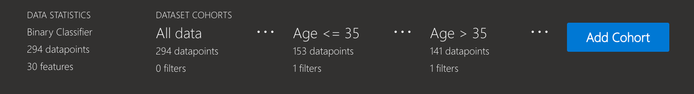

### Model performance

This tab enables you to evaluate your model by observing its performance metrics and prediction probabilities/classes/values across different cohorts.

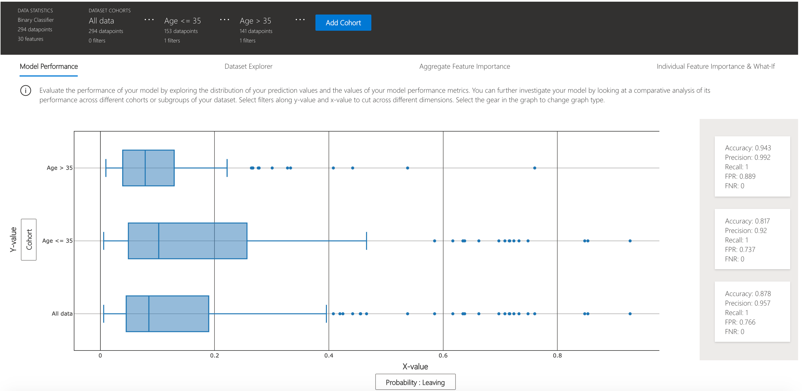

### Dataset explorer
You can explore your dataset statistics by selecting different filters along the X, Y, and color axes of this tab to slice your data into different dimensions.


The following plots provide a global view of the trained model along with its predictions and explanations.

### Aggregate feature importance (global explanation)

This view consists of two charts:

| Plot | Description |
| --- | --- |
| Feature Importance | Explore the top K important features that impact your overall model predictions (a.k.a. global explanation). Use the slider to show additional less important feature values. Select up to three cohorts to see their feature importance values side by side. |
| Dependence Plot | Click on any of the feature bars in the feature importance graph to see the relationship of the values of the selected feature to its corresponding feature importance values. Overall, this plot show how values of the selected feature impact model prediction. |

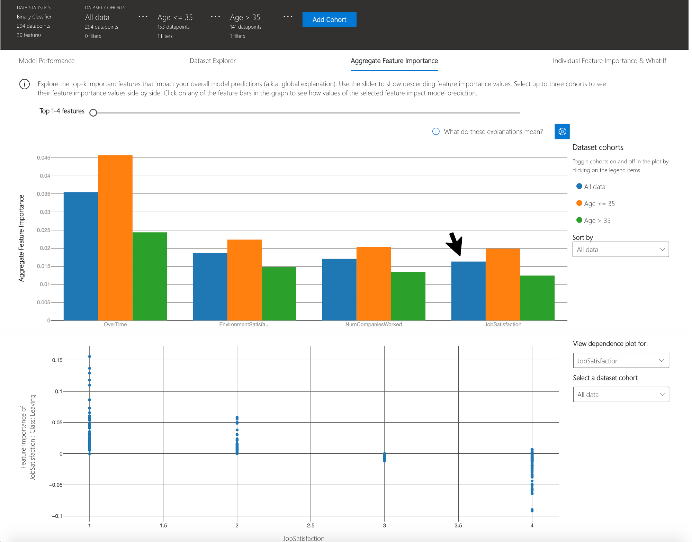

### Individual feature importance (local explanation) and what-if

You can click on any individual data point on the scatter plot to view its local feature importance values (local explanation) and individual conditional expectation (ICE) plot below. These are the capabilities covered in this tab:

| Plot | Description |
| --- | --- |
| Feature Importance Plot | Shows the top K (configurable K) important features for an individual prediction. Helps illustrate the local behavior of the underlying model on a specific data point. |
| Individual Conditional Expectation (ICE) | Allows feature value changes from a minimum value to a maximum value. Helps illustrate how the data point's prediction changes when a feature changes. |
| Perturbation Exploration (what-if analysis) | Allows changes to feature values of the selected data point to observe resulting changes to prediction value. You can then save your hypothetical what-if data point. |

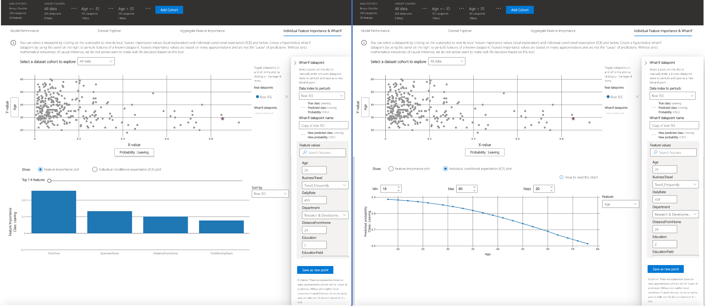


<a name="error dashboard"></a>

## Error Analysis Dashboard

Introducing the latest addition to the Responsible AI open-source toolkit collection, Error Analysis drives deeper to provide a better understanding of your machine learning model's behaviors. Use Error Analysis to identify cohorts with higher error rates and diagnose the root causes behind these errors. Combined with [Fairlearn](github.com/fairlearn/fairlearn) and [Interpret-Community](https://github.com/interpretml/interpret-community), practitioners can perform a wide variety of assessment operations to build responsible machine learning. Use this dashboard to:

1. Evaluate Cohorts: Learn how errors distribute across different cohorts at different levels of granularity 
2. Explore Predictions: Use built-in interpretability features or combine with InterpretML for boosted debugging capability 
3. Interactive Dashboard View customizable pre-built visuals to quickly identify errors and diagnose root causes

Run the dashboard via:

```python
from raiwidgets import ErrorAnalysisDashboard

ErrorAnalysisDashboard(global_explanation, dashboard_pipeline, dataset=X_test_original,
                       true_y=y_test, categorical_features=categorical_features)
```
Once you load the visualization dashboard, you can investigate different aspects of your dataset and trained model via two stages:

* Identification
* Diagnosis

---
**NOTE**

Click on "Open in a new tab" on the top left corner to get a better view of the dashboard in a new tab.

---

### Identification of Errors

Error Analysis identifies cohorts of data with higher error rate than the overall benchmark. These discrepancies might occur when the system or model underperforms for specific demographic groups or infrequently observed input conditions in the training data.

#### Different Methods for Error Identification

1. Decision Tree: Discover cohorts with high error rates across multiple features using the binary tree visualization. Investigate indicators such as error rate, error coverage, and data representation for each discovered cohort. 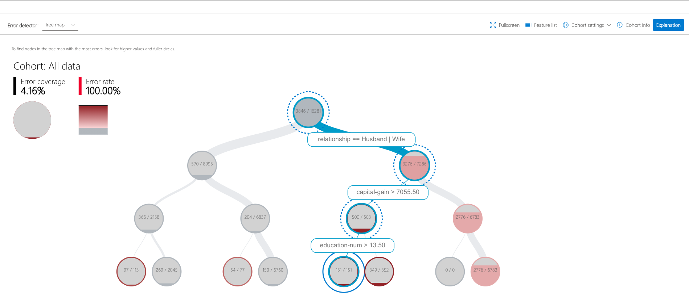

2. Error Heatmap: Once you form hypotheses of the most impactful features for failure, use the Error Heatmap to further investigate how one or two input features impact the error rate across cohorts. 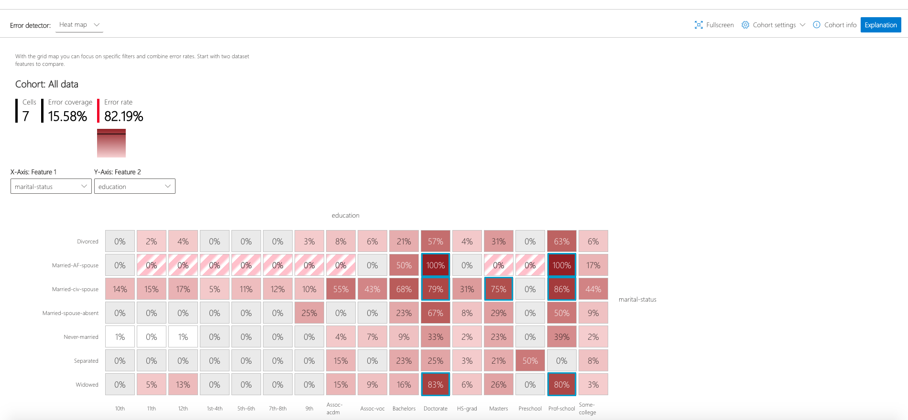

### Diagnosis of Errors

After identifying cohorts with higher error rates, Error Analysis enables debugging and exploring these cohorts further. Gain deeper insights about the model or the data through data exploration and model explanation. Different Methods for Error Diagnosis:

1. Data Exploration which explores dataset statistics and feature distributions. Compare cohort data stats with other cohorts or to benchmark data. Investigate whether certain cohorts are underrepresented or if their feature distribution is significantly different from the overall data.

2. Global Explanation which explore the top K important features that impact the overall model global explanation for a selected cohort of data. Understand how values of features impact model prediction. Compare explanations with those from other cohorts or benchmark.

3. Local Explanation which enables observing the raw data in the Instance View. Understand how each data point has correct or incorrect prediction. Visually identify any missing features or label noise that could lead to issues. Explore local feature importance values (local explanation) and individual conditional expectation (ICE) plots.

4. What-if analysis (Perturbation Exploration) which applies changes to feature values of selected data point and observe resulting changes to the prediction.

<a name="fairness dashboard"></a>

## Fairness Dashboard

Please refer to [Fairlearn](https://github.com/fairlearn/fairlearn)'s README and [user guide](https://fairlearn.github.io/v0.5.0/user_guide/index.html) to learn how you can assess and mitigate model's fairness issues.  Once your model is trained, load the Fairness dashboard in your notebook to understand how your model’s predictions impact different groups (e.g., different ethnicities). Compare multiple models along different fairness and performance metrics.

### Setup and single-model assessment
To assess a single model’s fairness and performance, the dashboard widget can be launched within a Jupyter notebook as follows:

```python
from raiwidgets import FairnessDashboard

# A_test contains your sensitive features (e.g., age, binary gender)
# y_true contains ground truth labels
# y_pred contains prediction labels

FairnessDashboard(sensitive_features=A_test,
                  y_true=Y_test.tolist(),
                  y_pred=[y_pred.tolist()])
```

Once you load the visualization dashboard, the widget walks the user through the assessment setup, where the user is asked to select
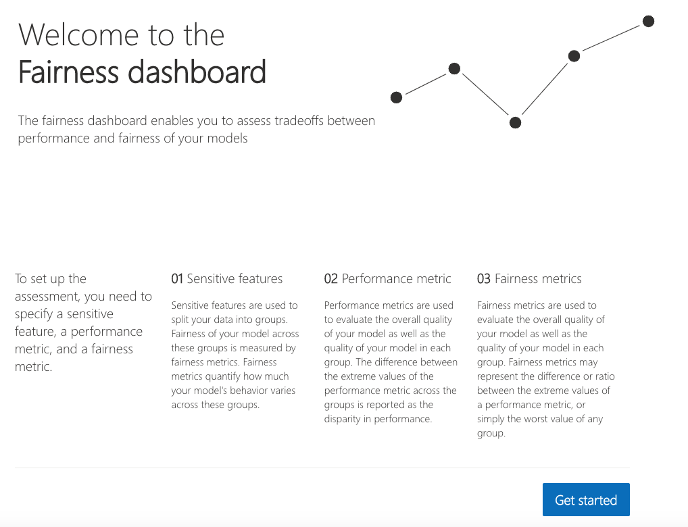

1. The sensitive feature of interest (e.g., ```binary gender``` or ```age```).
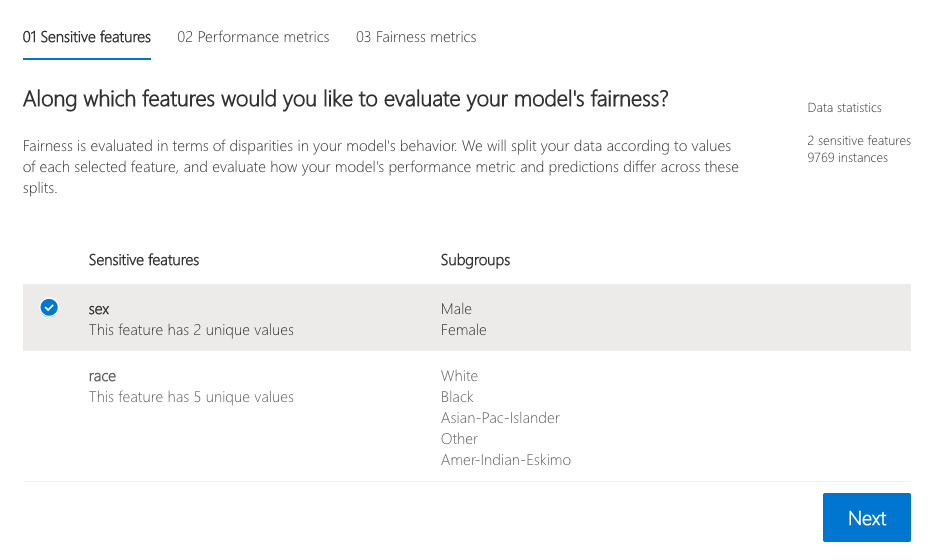

2. The performance metric (e.g., model precision) along which to evaluate the overall model performance. 
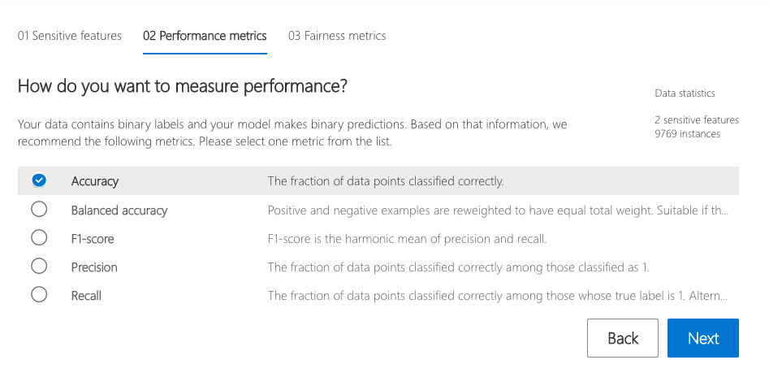

3. The fairness metric (e.g., demographic parity ratio) along which to evaluate any disparities across groups. 
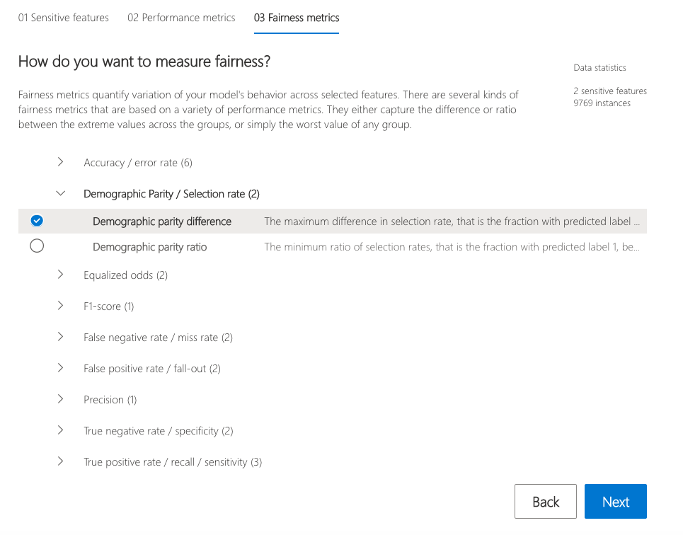

These selections are then used to obtain the visualization of the model’s impact on the subgroups.  (e.g., one is interested to consider non-binary gender for fairness testing and selects "demographic parity ratio" as a metric of interest to see how females and males are selected to get a loan).

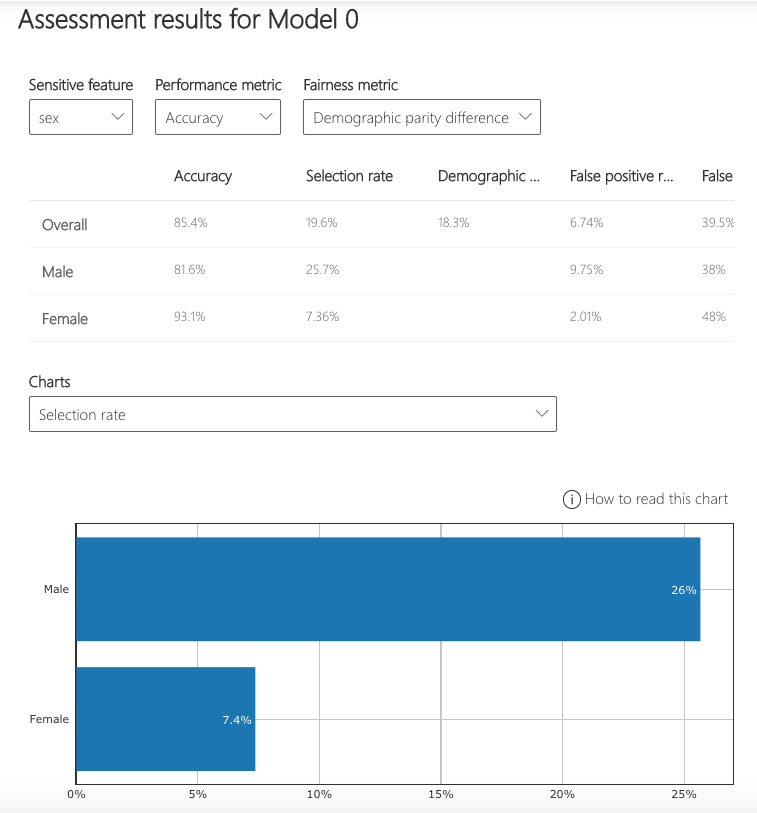

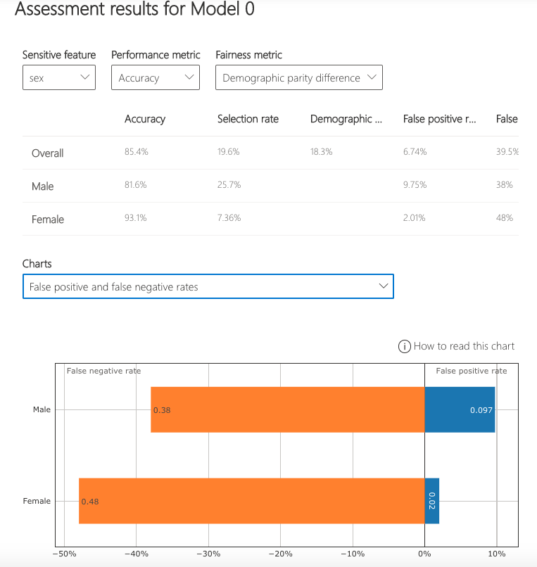

### Comparing multiple models

The dashboard also enables comparison of multiple models, such as the models produced by different learning algorithms and different mitigation approaches, including Fairlearn's [GridSearch](https://fairlearn.github.io/v0.5.0/api_reference/fairlearn.reductions.html#fairlearn.reductions.GridSearch), [ExponentiatedGradient](https://fairlearn.github.io/v0.5.0/api_reference/fairlearn.reductions.html#fairlearn.reductions.ExponentiatedGradient), and [ThresholdOptimizer](https://fairlearn.github.io/v0.5.0/api_reference/fairlearn.postprocessing.html#fairlearn.postprocessing.ThresholdOptimizer).

As before, select the sensitive feature and the performance metric. The model comparison view then depicts the performance and disparity of all the provided models in a scatter plot. This allows the you to examine trade-offs between performance and fairness. Each of the dots can be clicked to open the assessment of the corresponding model. The figure below shows the model comparison view with ```binary gender``` selected as a sensitive feature and accuracy rate selected as the performance metric.

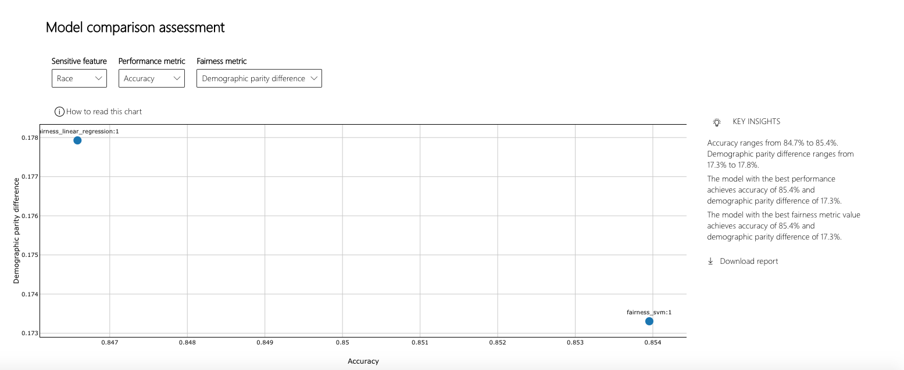
 
<a name="supported models"></a>

## Supported Models

This interpretability and error analysis API supports models that are trained on datasets in Python `numpy.array`, `pandas.DataFrame`, `iml.datatypes.DenseData`, or `scipy.sparse.csr_matrix` format.

The explanation functions of [Interpret-Community](https://github.com/interpretml/interpret-community) accept both models and pipelines as input as long as the model or pipeline implements a `predict` or `predict_proba` function that conforms to the Scikit convention. If not compatible, you can wrap your model's prediction function into a wrapper function that transforms the output into the format that is supported (predict or predict_proba of Scikit), and pass that wrapper function to your selected interpretability techniques.  

If a pipeline script is provided, the explanation function assumes that the running pipeline script returns a prediction. The repository also supports models trained via **PyTorch**, **TensorFlow**, and **Keras** deep learning frameworks.

<a name="getting started"></a>

## Getting Started

This repository uses Anaconda to simplify package and environment management.

To setup on your local machine:

<details><summary><strong><em>Install Python module, packages and necessary distributions</em></strong></summary>

```
pip install raiwidgets
```

If you intend to run repository tests:

```
pip install -r requirements.txt
```

</details>

<details>
<summary><strong><em>Set up and run Jupyter Notebook server </em></strong></summary>

Install and run Jupyter Notebook

```
if needed:
          pip install jupyter
then:
jupyter notebook
```
</details>

## Maintainers

- [Ke Xu](https://github.com/KeXu444)
- [Roman Lutz](https://github.com/romanlutz)
- [Ilya Matiach](https://github.com/imatiach-msft)
- [Dawei Li](https://github.com/chnldw)
