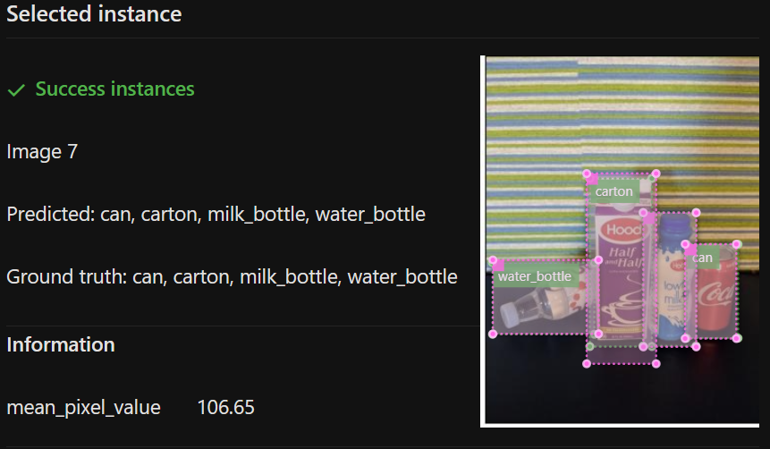
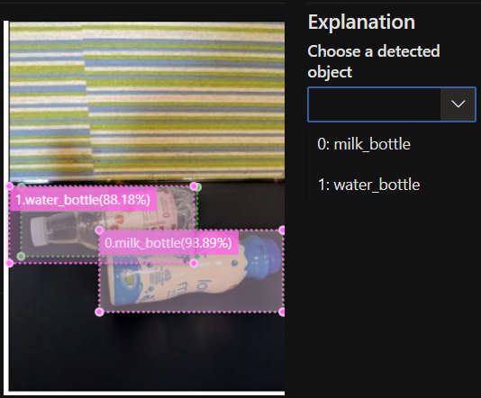

           

# CanvasTools

The Object Detection dashboard supports image loading and bounding box rendering with the CanvasTools-vott library in typescript.

The annotations for smaller boxes are automatically truncated by piggybacking on the exiting functionality.

Compared to FluentUI’s `<Image>` tag for loading the image in the Flyout (utilized for all other image scenarios), CanvasTools has the following advantages:

1. Reusability with Data Labeling team's work, which unlocks loading and overlaying elements on images for CV tasks.

2. Enables drawing bounding boxes in the frontend, which can enable future functionality of filtering/displaying bounding boxes based on user inputs on-the-fly related to error types, classes etc.

3. Piggybacks on CanvasTools' accessibility standards

4. Unlike bounding boxes drawn in the backend using opencv, CanvasTools enables usage of FluentUI color palette references.

5. Higher resolution display

Source Repo - 
