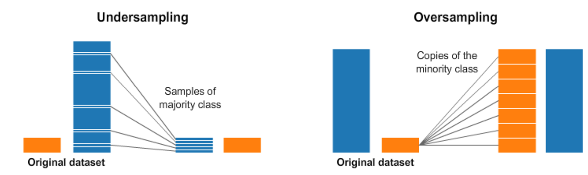
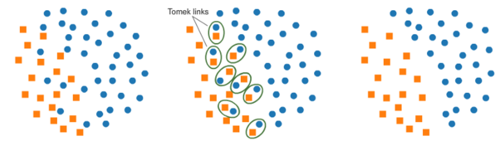
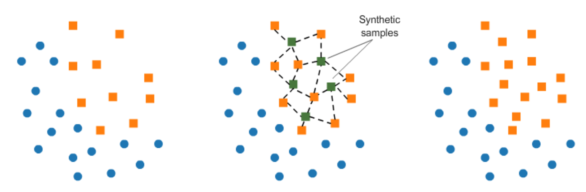
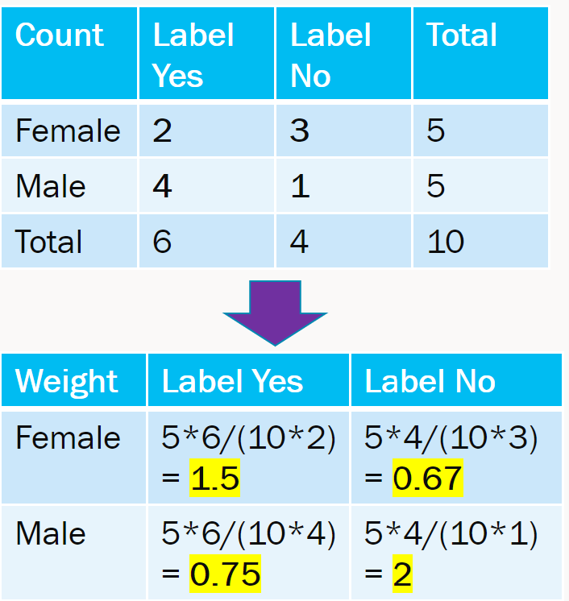

           

# Data Balance

## Context

Data Balance is relevant for gaining an overall understanding of datasets, but it becomes essential when thinking about building AI systems in a responsible way, especially in terms of fairness.

AI systems can sometimes exhibit unwanted, unfair behaviors. These behaviors can cause fairness-related harms that affect various groups of people, often amplifying marginalization of particular groups whose needs and contexts are typically overlooked during the AI development and deployment life cycle. Fairness-related harms can have varying severities, and the cumulative impact of even seemingly non-severe harms can be burdensome.

Fairness-related harms include:

- **Allocation harms**: When an AI system extends or withholds opportunities or resources in ways that negatively impact people’s lives.
- **Quality of service harms**: When an AI system does not work as well for one group of people as it does for another.
- **Stereotyping harms**: When an AI system makes unfair generalizations about groups of people and reinforces negative stereotypes.
- **Demeaning harms**: When an AI system is actively derogatory or offensive.
- **Over- and underrepresentation harms**: When an AI system over- or underrepresents some groups of people or may even erase some groups entirely.

**Note**: _Because fairness in AI is fundamentally a sociotechnical challenge, it is often impossible to fully “de-bias” an AI system. Instead, teams tasked with developing and deploying AI systems must work to identify, measure, and mitigate fairness-related harms as much as possible. Data Balance is a tool to help do so, in combination with others._

Data Balance consists of a combination of three groups of measures: Feature Balance Measures, Distribution Balance Measures, and Aggregate Balance Measures.

In summary, Data Balance, when used as a step for building ML models, has the following benefits:

- It reduces costs of ML building through the early identification of data representation gaps that prompt data scientists to seek mitigation steps (such as collecting more data, following a specific sampling mechanism, creating synthetic data, and so on) before proceeding to train their models.
- It enables easy end-to-end debugging of ML systems in combination with the [RAI Toolbox](https://responsibleaitoolbox.ai/responsible-ai-toolbox-capabilities/) by providing a clear view of model-related issues versus data-related issues.

## Examples

Within the [Responsible AI Dashboard](https://github.com/microsoft/responsible-ai-widgets/blob/master/notebooks/responsibleaidashboard/tour.ipynb), data balance measures are automatically computed for the dataset if the following criteria is met:

- The task type is `classification`.
- A non-empty list of categorical features is specified.

Data balance measures are automatically computed for the following examples:

- [Model debugging of a census income prediction model (classification)](https://github.com/microsoft/responsible-ai-toolbox/tree/main/notebooks/responsibleaidashboard/responsibleaidashboard-census-classification-model-debugging.ipynb)

## Usage

TODO

## Measure Explanations

### Feature Balance Measures

Feature Balance Measures allow us to see whether each combination of sensitive feature is receiving the positive outcome (true prediction) at balanced probability.

In this context, we define a feature balance measure, also referred to as the parity, for label y as the difference between the association metrics of two different sensitive classes $[x_A, x_B]$, with respect to the association metric $A(x_i, y)$. That is:

$parity(y \vert x_A, x_B, A(\cdot)) \coloneqq A(x_A, y) - A(x_B, y)$

Using the dataset, we can see if the various sexes and races are receiving >50k income at equal or unequal rates.

Note: Many of these metrics were influenced by this paper [Measuring Model Biases in the Absence of Ground Truth](https://arxiv.org/abs/2103.03417).

| Association Metric                                 | Family                            | Description                                                                                                                                                                                                                                | Interpretation/Formula                                                                                                 | Reference                                                                    |
| -------------------------------------------------- | --------------------------------- | ------------------------------------------------------------------------------------------------------------------------------------------------------------------------------------------------------------------------------------------ | ---------------------------------------------------------------------------------------------------------------------- | ---------------------------------------------------------------------------- |
| Statistical Parity                                 | Fairness                          | Proportion of each segment of a protected class (e.g. gender) should receive the positive outcome at equal rates.                                                                                                                          | As close to 0 means better parity. $DP = P(Y \vert A = "Male") - P(Y \vert A = "Female")$.                             | [Link](https://en.wikipedia.org/wiki/Fairness_%28machine_learning%29)        |
| Pointwise Mutual Information (PMI), normalized PMI | Entropy                           | The PMI of a pair of feature values (ex: Gender=Male and Gender=Female) quantifies the discrepancy between the probability of their coincidence given their joint distribution and their individual distributions (assuming independence). | Range (normalized) $[-1, 1]$. -1 for no co-occurences. 0 for co-occurences at random. 1 for complete co-occurences.    | [Link](https://en.wikipedia.org/wiki/Pointwise_mutual_information)           |
| Sorensen-Dice Coefficient (SDC)                    | Intersection-over-Union           | Used to gauge the similarity of two samples. Related to F1 score.                                                                                                                                                                          | Equals twice the number of elements common to both sets divided by the sum of the number of elements in each set.      | [Link](https://en.wikipedia.org/wiki/S%C3%B8rensen%E2%80%93Dice_coefficient) |
| Jaccard Index                                      | Intersection-over-Union           | Similar to SDC, guages the similarity and diversity of sample sets.                                                                                                                                                                        | Equals the size of the intersection divided by the size of the union of the sample sets.                               | [Link](https://en.wikipedia.org/wiki/Jaccard_index)                          |
| Kendall Rank Correlation                           | Correlation and Statistical Tests | Used to measure the ordinal association between two measured quantities.                                                                                                                                                                   | High when observations have a similar rank and low when observations have a dissimilar rank between the two variables. | [Link](https://en.wikipedia.org/wiki/Kendall_rank_correlation_coefficient)   |
| Log-Likelihood Ratio                               | Correlation and Statistical Tests | Calculates the degree to which data supports one variable versus another. Log of the likelihood ratio, which gives the probability of correctly predicting the label in ratio to probability of incorrectly predicting label.              | If likelihoods are similar, it should be close to 0.                                                                   | [Link](https://en.wikipedia.org/wiki/Likelihood_function#Likelihood_ratio)   |
| t-test                                             | Correlation and Statistical Tests | Used to compare the means of two groups (pairwise).                                                                                                                                                                                        | Value looked up in t-Distribution tell if statistically significant or not.                                            | [Link](https://en.wikipedia.org/wiki/Student's_t-test)                       |

### Distribution Balance Measures

Distribution Balance Measures allow us to compare our data with a reference distribution (currently only uniform distribution is supported as a reference distribution). They are calculated per sensitive column and do not depend on the label column.

For example, let's assume we have a dataset with 9 rows and a Gender column, and we observe that:

- "Male" appears 4 times
- "Female" appears 3 times
- "Other" appears 2 times

Assuming the uniform distribution:

$$
ReferenceCount \coloneqq  \frac{numRows}{numFeatureValues}
$$

$$
ReferenceProbability \coloneqq  \frac{1}{numFeatureValues}
$$

| Feature Value | Observed Count | Reference Count | Observed Probability | Reference Probabiliy |
| ------------- | -------------- | --------------- | -------------------- | -------------------- |
| Male          | 4              | 9/3 = 3         | 4/9 = 0.44           | 3/9 = 0.33           |
| Female        | 3              | 9/3 = 3         | 3/9 = 0.33           | 3/9 = 0.33           |
| Other         | 2              | 9/3 = 3         | 2/9 = 0.22           | 3/9 = 0.33           |

We can use distance measures to find out how far our observed and reference distributions of these feature values are. Some of these distance measures include:

| Measure                  | Description                                                                                                                                                                                                                                                                                                                                               | Interpretation                                                                                                           | Reference                                                                              |
| ------------------------ | --------------------------------------------------------------------------------------------------------------------------------------------------------------------------------------------------------------------------------------------------------------------------------------------------------------------------------------------------------- | ------------------------------------------------------------------------------------------------------------------------ | -------------------------------------------------------------------------------------- |
| KL Divergence            | Measure of how one probability distribution is different from a second, reference probability distribution. Measure of the information gained when one revises one's beliefs from the prior probability distribution Q to the posterior probability distribution P. In other words, it is the amount of information lost when Q is used to approximate P. | Non-negative. 0 means P = Q.                                                                                             | [Link](https://en.wikipedia.org/wiki/Kullback%E2%80%93Leibler_divergence)              |
| JS Distance              | Measuring the similarity between two probability distributions. Symmetrized and smoothed version of the Kullback–Leibler (KL) divergence. Square root of JS Divergence.                                                                                                                                                                                   | Range [0, 1]. 0 means perfectly same to balanced distribution.                                                           | [Link](https://en.wikipedia.org/wiki/Jensen%E2%80%93Shannon_divergence)                |
| Wasserstein Distance     | This distance is also known as the earth mover’s distance, since it can be seen as the minimum amount of “work” required to transform u into v, where “work” is measured as the amount of distribution weight that must be moved, multiplied by the distance it has to be moved.                                                                          | Non-negative. 0 means P = Q.                                                                                             | [Link](https://en.wikipedia.org/wiki/Wasserstein_metric)                               |
| Infinity Norm Distance   | Distance between two vectors is the greatest of their differences along any coordinate dimension. Also called Chebyshev distance or chessboard distance.                                                                                                                                                                                                  | Non-negative. 0 means same distribution.                                                                                 | [Link](https://en.wikipedia.org/wiki/Chebyshev_distance)                               |
| Total Variation Distance | It is equal to half the L1 (Manhattan) distance between the two distributions. Take the difference between the two proportions in each category, add up the absolute values of all the differences, and then divide the sum by 2.                                                                                                                         | Non-negative. 0 means same distribution.                                                                                 | [Link](https://en.wikipedia.org/wiki/Total_variation_distance_of_probability_measures) |
| Chi-Squared Test         | The chi-square test tests the null hypothesis that the categorical data has the given frequencies given expected frequencies in each category.                                                                                                                                                                                                            | p-value gives evidence against null-hypothesis that difference in observed and expected frequencies is by random chance. | [Link](https://en.wikipedia.org/wiki/Chi-squared_test)                                 |

### Aggregate Balance Measures

Aggregate Balance Measures allow us to obtain a higher notion of inequality. They are calculated on the set of all sensitive columns and do not depend on the label column.

These measures look at distribution of records across all combinations of sensitive columns. For example, if Sex and Race are specified as sensitive features, it then tries to quantify imbalance across all combinations of the two specified features - (Male, Black), (Female, White), (Male, Asian-Pac-Islander), etc.

| Measure        | Description                                                                                                                                                                                                                                                                                                                                                                                                                                                                                                                                                      | Interpretation                                                                                                                                                                                      | Reference                                            |
| -------------- | ---------------------------------------------------------------------------------------------------------------------------------------------------------------------------------------------------------------------------------------------------------------------------------------------------------------------------------------------------------------------------------------------------------------------------------------------------------------------------------------------------------------------------------------------------------------- | --------------------------------------------------------------------------------------------------------------------------------------------------------------------------------------------------- | ---------------------------------------------------- |
| Atkinson Index | It presents the percentage of total income that a given society would have to forego in order to have more equal shares of income between its citizens. This measure depends on the degree of society aversion to inequality (a theoretical parameter decided by the researcher), where a higher value entails greater social utility or willingness by individuals to accept smaller incomes in exchange for a more equal distribution. An important feature of the Atkinson index is that it can be decomposed into within-group and between-group inequality. | Range $[0, 1]$. 0 if perfect equality. 1 means maximum inequality. In our case, it is the proportion of records for a sensitive columns’ combination.                                               | [Link](https://en.wikipedia.org/wiki/Atkinson_index) |
| Theil T Index  | GE(1) = Theil's T and is more sensitive to differences at the top of the distribution. The Theil index is a statistic used to measure economic inequality. The Theil index measures an entropic "distance" the population is away from the "ideal" egalitarian state of everyone having the same income.                                                                                                                                                                                                                                                         | If everyone has the same income, then T_T equals 0. If one person has all the income, then T_T gives the result $ln(N)$. 0 means equal income and larger values mean higher level of disproportion. | [Link](https://en.wikipedia.org/wiki/Theil_index)    |
| Theil L Index  | GE(0) = Theil's L and is more sensitive to differences at the lower end of the distribution. Logarithm of (mean income)/(income i), over all the incomes included in the summation. It is also referred to as the mean log deviation measure. Because a transfer from a larger income to a smaller one will change the smaller income's ratio more than it changes the larger income's ratio, the transfer-principle is satisfied by this index.                                                                                                                 | Same interpretation as Theil T Index.                                                                                                                                                               | [Link](https://en.wikipedia.org/wiki/Theil_index)    |

## Mitigation

It will not be a stretch to say that every real-world dataset has caveats, biases, and imbalances. Data collection is costly. Data Imbalance mitigation is an area of research. There are many techniques available at various stages of ML lifecycle i.e., during pre-processing, in-processing, and post processing. Here, we outline a couple of pre-processing techniques.

### Resampling

This involves under-sampling from majority class and over-sampling from minority class. Most naïve way to over-sample would be duplicate records and under-sample would be to remove records at random.

- Caveats:

  1. Under-sampling may remove valuable information.
  2. Over-sampling may cause overfitting and poor generalization on test set.

There are smarter techniques to under-sample and over-sample in literature and implemented in Python’s [imbalanced-learn](https://imbalanced-learn.org/stable/) package.

For example, we can cluster the records of the majority class, and do the under-sampling by removing records from each cluster, thus seeking to preserve information.

One technique of under-sampling is use of Tomek Links. Tomek links are pairs of very close instances but of opposite classes. Removing the instances of the majority class of each pair increases the space between the two classes, facilitating the classification process. A similar way to under-sample majority class is using Near-Miss. It first calculates the distance between all the points in the larger class with the points in the smaller class. When two points belonging to different classes are very close to each other in the distribution, this algorithm eliminates the datapoint of the larger class thereby trying to balance the distribution.

In over-sampling, instead of creating exact copies of the minority class records, we can introduce small variations into those copies, creating more diverse synthetic samples. This technique is called SMOTE (Synthetic Minority Oversampling Technique). It randomly picks a point from the minority class and computes the k-nearest neighbors for this point. The synthetic points are added between the chosen point and its neighbors.

### Reweighting

There is an expected and observed value in each table cell. The weight is essentially expected / observed value. This is easy to extend to multiple features with more than 2 groups. The weights are then incorporated in loss function of model training.

