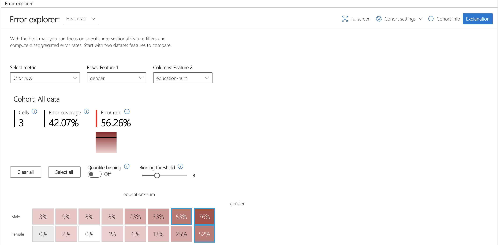

           

# Error Analysis


Responsible-AI-Widgets provides a collection of model and data exploration and assessment user interfaces that enable a better understanding of AI systems. One of these interfaces is Error Analysis (+ Interpretability) dashboard.

You can use the Error Analysis dashboard to 
1) ***Identify*** cohorts with high error rate versus benchmark and visualize how the error rate is distributed. 
2) ***Diagnose*** the root causes of the errors by visually diving deeper into the characteristics of data and models (via its embedded interpretability capabilities). 

For instance, you can use Error Analysis to discover that the model has a higher error rate for a specific cohort (e.g., females with income <$50K) vs. the rest of the population. Via its embedded interpretability capabilities of this dashboard, you can next understand the most impactful factors responsible for this subset’s erroneous predictions, inspect some individual records of that cohort receiving erroneous predictions, understand their feature importance values, and perform what-if analysis on them to diagnose the contributing error factors better. 


## Example Notebooks

- [Error analysis and interpretability of a census income prediction model](https://github.com/microsoft/responsible-ai-widgets/blob/master/notebooks/individual-dashboards/erroranalysis-dashboard/erroranalysis-interpretability-dashboard-census.ipynb)
- [Error analysis and interpretability of a breast cancer prediction model](https://github.com/microsoft/responsible-ai-widgets/blob/master/notebooks/individual-dashboards/erroranalysis-dashboard/erroranalysis-interpretability-dashboard-breast-cancer.ipynb)
- [Error analysis of a multi class classification model](https://github.com/microsoft/responsible-ai-widgets/blob/master/notebooks/individual-dashboards/erroranalysis-dashboard/erroranalysis-dashboard-multiclass.ipynb)
- [Error analysis of a boston housing price prediction model](https://github.com/microsoft/responsible-ai-widgets/blob/master/notebooks/individual-dashboards/erroranalysis-dashboard/erroranalysis-dashboard-regression-boston-housing.ipynb)
- [Error analysis of a critical temperature of superconductors prediction model](https://github.com/microsoft/responsible-ai-widgets/blob/master/notebooks/individual-dashboards/erroranalysis-dashboard/erroranalysis-dashboard-regression-superconductor.ipynb)

<a name="interpretability dashboard"></a>


<a name="error analysis dashboard "></a>

## Error Analysis Dashboard

Error Analysis drives deeper to provide a better understanding of your machine learning model's behaviors. Use Error Analysis to identify cohorts with higher error rates and diagnose the root causes behind these errors. Combined with [Fairlearn](github.com/fairlearn/fairlearn) and [Interpret-Community](https://github.com/interpretml/interpret-community), practitioners can perform a wide variety of assessment operations to build responsible machine learning. Use this dashboard to:

1. Evaluate Cohorts: Learn how errors distribute across different cohorts at different levels of granularity 
2. Explore Predictions: Use built-in interpretability features or combine with InterpretML for boosted debugging capability 
3. Interactive Dashboard View customizable pre-built visuals to quickly identify errors and diagnose root causes

Run the dashboard via:

```python
from raiwidgets import ErrorAnalysisDashboard

ErrorAnalysisDashboard(global_explanation, dashboard_pipeline, dataset=X_test_original,
                       true_y=y_test, categorical_features=categorical_features)
```
Once you load the visualization dashboard, you can investigate different aspects of your dataset and trained model via two stages:

* Identification
* Diagnosis

---
**NOTE**

Click on "Open in a new tab" on the top left corner to get a better view of the dashboard in a new tab.

---

### Identification of Errors

Error Analysis identifies cohorts of data with higher error rate than the overall benchmark. These discrepancies might occur when the system or model underperforms for specific demographic groups or infrequently observed input conditions in the training data.

#### Different Methods for Error Identification

1. Decision Tree: Discover cohorts with high error rates across multiple features using the binary tree visualization. Investigate indicators such as error rate, error coverage, and data representation for each discovered cohort. 

2. Error Heatmap: Once you form hypotheses of the most impactful features for failure, use the Error Heatmap to further investigate how one or two input features impact the error rate across cohorts. 

### Diagnosis of Errors

After identifying cohorts with higher error rates, Error Analysis enables debugging and exploring these cohorts further. Gain deeper insights about the model or the data through data exploration and model explanation. Different Methods for Error Diagnosis:

1. Data Exploration which explores dataset statistics and feature distributions. Compare cohort data stats with other cohorts or to benchmark data. Investigate whether certain cohorts are underrepresented or if their feature distribution is significantly different from the overall data.

2. Global Explanation which explore the top K important features that impact the overall model global explanation for a selected cohort of data. Understand how values of features impact model prediction. Compare explanations with those from other cohorts or benchmark.

3. Local Explanation which enables observing the raw data in the Instance View. Understand how each data point has correct or incorrect prediction. Visually identify any missing features or label noise that could lead to issues. Explore local feature importance values (local explanation) and individual conditional expectation (ICE) plots.

4. What-if analysis (Perturbation Exploration) which applies changes to feature values of selected data point and observe resulting changes to the prediction.


<a name="supported models"></a>

## Supported Models

This interpretability and error analysis API supports regression and classification models that are trained on datasets in Python `numpy.array`, `pandas.DataFrame`, `iml.datatypes.DenseData`, or `scipy.sparse.csr_matrix` format.

The explanation functions of [Interpret-Community](https://github.com/interpretml/interpret-community) accept both models and pipelines as input as long as the model or pipeline implements a `predict` or `predict_proba` function that conforms to the Scikit convention. If not compatible, you can wrap your model's prediction function into a wrapper function that transforms the output into the format that is supported (predict or predict_proba of Scikit), and pass that wrapper function to your selected interpretability techniques.  

If a pipeline script is provided, the explanation function assumes that the running pipeline script returns a prediction. The repository also supports models trained via **PyTorch**, **TensorFlow**, and **Keras** deep learning frameworks.

<a name="getting started"></a>

## Getting Started

This repository uses Anaconda to simplify package and environment management.

To setup on your local machine:

<details><summary><strong><em>Install Python module, packages and necessary distributions</em></strong></summary>

```
pip install raiwidgets
```

If you intend to run repository tests:

```
pip install -r requirements.txt
```

</details>

<details>
<summary><strong><em>Set up and run Jupyter Notebook server </em></strong></summary>

Install and run Jupyter Notebook

```
if needed:
          pip install jupyter
then:
jupyter notebook
```
</details>

