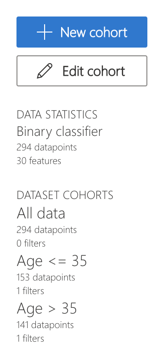
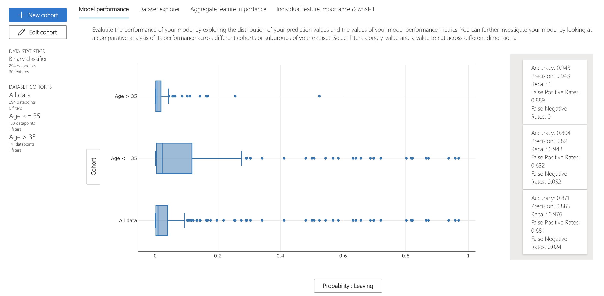
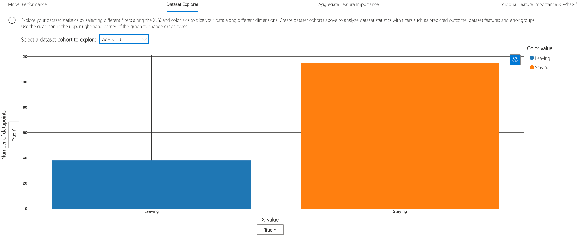
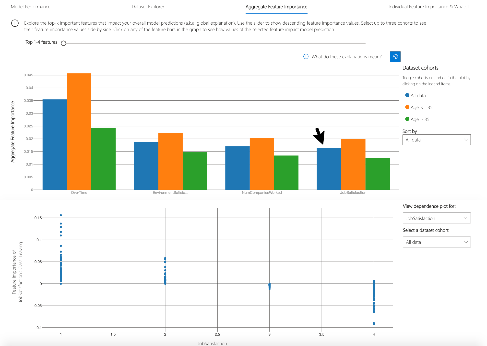
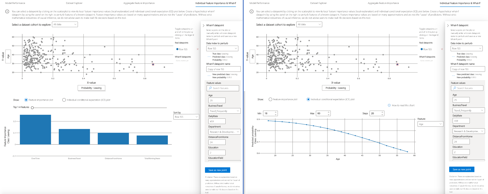

           

# Model Interpretability

Responsible-AI-Widgets provides a collection of model and data exploration and assessment user interfaces that enable a better understanding of AI systems. One of these interfaces is Explanation dashboard, which is a user interface for [Interpret-Community](https://github.com/interpretml/interpret-community).

You can use the Explanation dashboard to

1. Evaluate your model by observing its performance metrics.
2. Explore your dataset statistics.
3. Understand the most important factors impacting your model’s overall predictions (global explanation).
4. Understand individual predictions (local explanation).
5. Debug models by performing a variety of feature perturbation operations (e.g., what-if analysis and Individual Conditional Expectation Plots).
6. Understand your model’s explanations on different demographics.

For instance, you can use the explanation dashboard to understand which factors (a.k.a features) have the most impact on your loan allocation model's accept/deny decisions. Observe this for the whole population, for a subset of applicants (e.g., age < 40>), and individuals (such as why Taylor's loan got rejected).

## Example Notebooks

- [Interpretability for binary classification (employee attrition)](https://github.com/microsoft/responsible-ai-widgets/blob/master/notebooks/individual-dashboards/explanation-dashboard/explanation-dashboard-employee-attrition.ipynb)
- [Joint Example: Interpretability and fairness assessment a loan allocation model](https://github.com/microsoft/responsible-ai-widgets/blob/master/notebooks/individual-dashboards/fairness-explanation-dashboard-loan-allocation.ipynb) (Please see the [Fairness dashbaord](./fairness-dashboard-README.md) guide)

<a name="interpretability dashboard"></a>

## Interpretability Dashboard

Please refer to [Interpret-Community](https://github.com/interpretml/interpret-community)'s README and [sample notebooks](https://github.com/interpretml/interpret-community/tree/master/notebooks) to learn how you can train and generate model explanations. Once your model is trained and your explanation object is generated, load the interpretability visualization dashboard in your notebook to understand and interpret your model:

```python
from raiwidgets import ExplanationDashboard

ExplanationDashboard(global_explanation, model, dataset=X_test, true_y=y_test)
```

Once you load the visualization dashboard, you can investigate different aspects of your dataset and trained model via four tab views:

- Model Performance
- Data Explorer
- Aggregate Feature Importance
- Individual Feature Importance and what-if

---

**NOTE**

Click on "Open in a new tab" on the top left corner to get a better view of the dashboard in a new tab.

---

You can further create custom cohorts (subgroups of your dataset) to explore the insights across different subgroups (e.g., women vs. men). The created cohorts can contain more than one filter (e.g., age < 30 and sex = female) and will be visible from all of the four tabs. The following sections demonstrate the visualization dashboard capabilities on a [classification model trained on employee attrition dataset](https://github.com/microsoft/responsible-ai-widgets/blob/master/notebooks/interpretability-dashboard-employee-attrition.ipynb). Besides the default cohort (including the whole dataset), there are two additional cohorts created: employees with Age <= 35 and employees with Age > 35.

<p align="center">


</p>

### Model performance

This tab enables you to evaluate your model by observing its performance metrics and prediction probabilities/classes/values across different cohorts.



### Dataset explorer

You can explore your dataset statistics by selecting different filters along the X, Y, and color axes of this tab to slice your data into different dimensions.



The following plots provide a global view of the trained model along with its predictions and explanations.

### Aggregate feature importance (global explanation)

This view consists of two charts:

| Plot               | Description                                                                                                                                                                                                                                                        |
| ------------------ | ------------------------------------------------------------------------------------------------------------------------------------------------------------------------------------------------------------------------------------------------------------------ |
| Feature Importance | Explore the top K important features that impact your overall model predictions (a.k.a. global explanation). Use the slider to show additional less important feature values. Select up to three cohorts to see their feature importance values side by side.      |
| Dependence Plot    | Click on any of the feature bars in the feature importance graph to see the relationship of the values of the selected feature to its corresponding feature importance values. Overall, this plot show how values of the selected feature impact model prediction. |



### Individual feature importance (local explanation) and what-if

You can click on any individual data point on the scatter plot to view its local feature importance values (local explanation) and individual conditional expectation (ICE) plot below. These are the capabilities covered in this tab:

| Plot                                        | Description                                                                                                                                                             |
| ------------------------------------------- | ----------------------------------------------------------------------------------------------------------------------------------------------------------------------- |
| Feature Importance Plot                     | Shows the top K (configurable K) important features for an individual prediction. Helps illustrate the local behavior of the underlying model on a specific data point. |
| Individual Conditional Expectation (ICE)    | Allows feature value changes from a minimum value to a maximum value. Helps illustrate how the data point's prediction changes when a feature changes.                  |
| Perturbation Exploration (what-if analysis) | Allows changes to feature values of the selected data point to observe resulting changes to prediction value. You can then save your hypothetical what-if data point.   |




<a name="error analysis dashboard "></a>

## Supported Models

This interpretability and error analysis API supports regression and classification models that are trained on datasets in Python `numpy.ndarray`, `pandas.DataFrame`, `iml.datatypes.DenseData`, or `scipy.sparse.csr_matrix` format.

The explanation functions of [Interpret-Community](https://github.com/interpretml/interpret-community) accept both models and pipelines as input as long as the model or pipeline implements a `predict` or `predict_proba` function that conforms to the Scikit convention. If not compatible, you can wrap your model's prediction function into a wrapper function that transforms the output into the format that is supported (predict or predict_proba of Scikit), and pass that wrapper function to your selected interpretability techniques.

If a pipeline script is provided, the explanation function assumes that the running pipeline script returns a prediction. The repository also supports models trained via **PyTorch**, **TensorFlow**, and **Keras** deep learning frameworks.

<a name="getting started"></a>

## Getting Started

This repository uses Anaconda to simplify package and environment management.

To setup on your local machine:

<details><summary><strong><em>Install Python module, packages and necessary distributions</em></strong></summary>

```
pip install raiwidgets
```

If you intend to run repository tests:

```
pip install -r requirements.txt
```

</details>

<details>
<summary><strong><em>Set up and run Jupyter Notebook server </em></strong></summary>

Install and run Jupyter Notebook

```
if needed:
          pip install jupyter
then:
jupyter notebook
```

</details>
