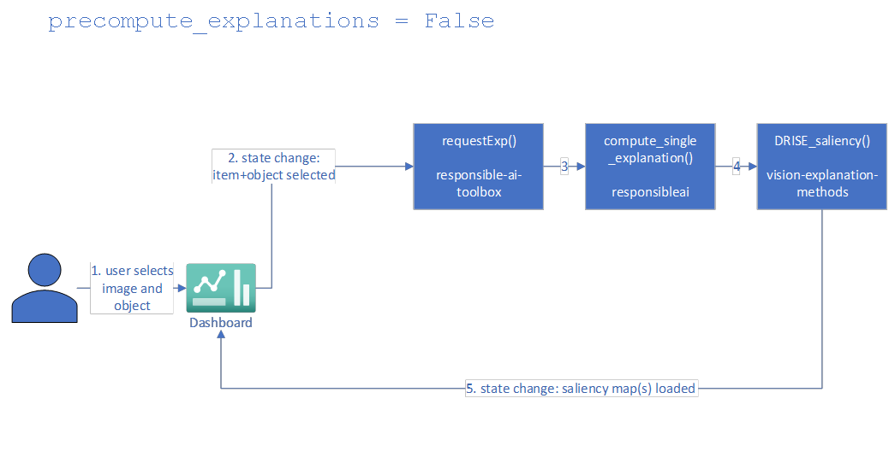

           

# Explanations For Object Detection Scenario

## Implementation Architecture

## Description

Currently, computer vision object detection AutoML customers only receive performance metrics and have asked for better ways to debug their models and obtain model explanations. Without the right tools and infrastructure, operationalizing Responsible AI is tedious, manual and time consuming with minimal instructions and very few disjointed frameworks. Metrics alone are not enough to inform and update subject matter experts and stakeholders.
Using visual explanations of object detection predictions, ML practitioners can gain stakeholder trust and ultimately build better models. That is where  comes into play.
In the RAI Dashboard (Object Detection scenario), we build in capabilities for data scientists to view saliency maps explaining predictions.

## User Experience

Explanations can be calculated on the fly or prior to instantiation of the dashboard. For the former, users can set precompute_explanations=False when creating the dashboard. For the latter, users can set precompute_explanations=True when creating the dashboard.  
Note that an **attached compute** will be required to access these explanations for either setting.
