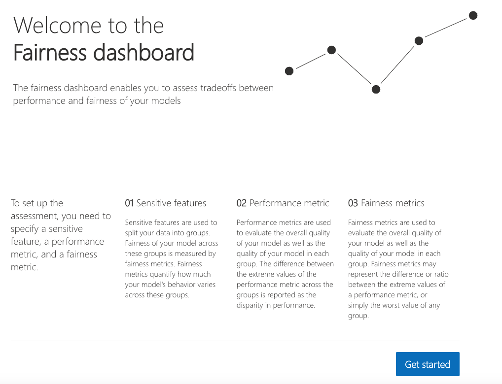
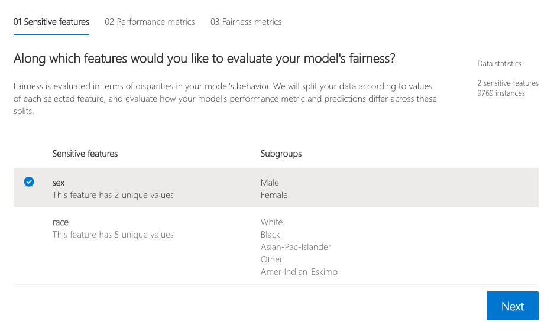
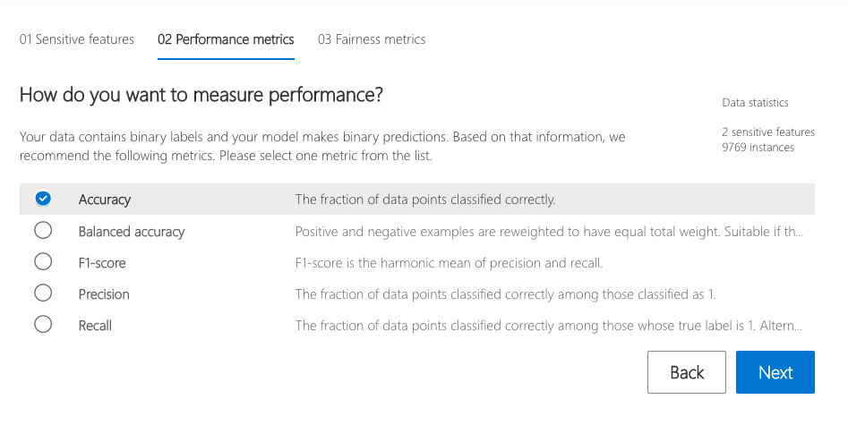
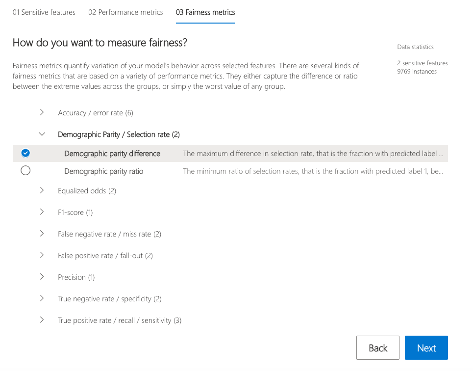
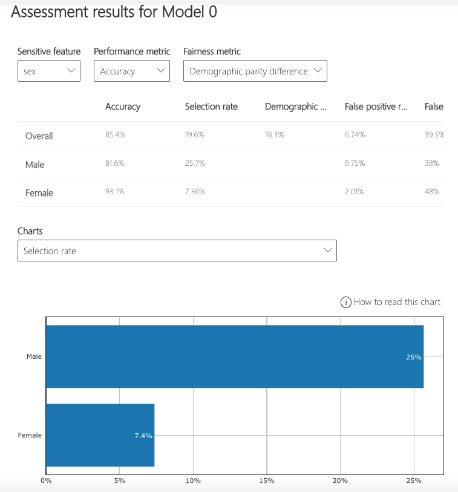
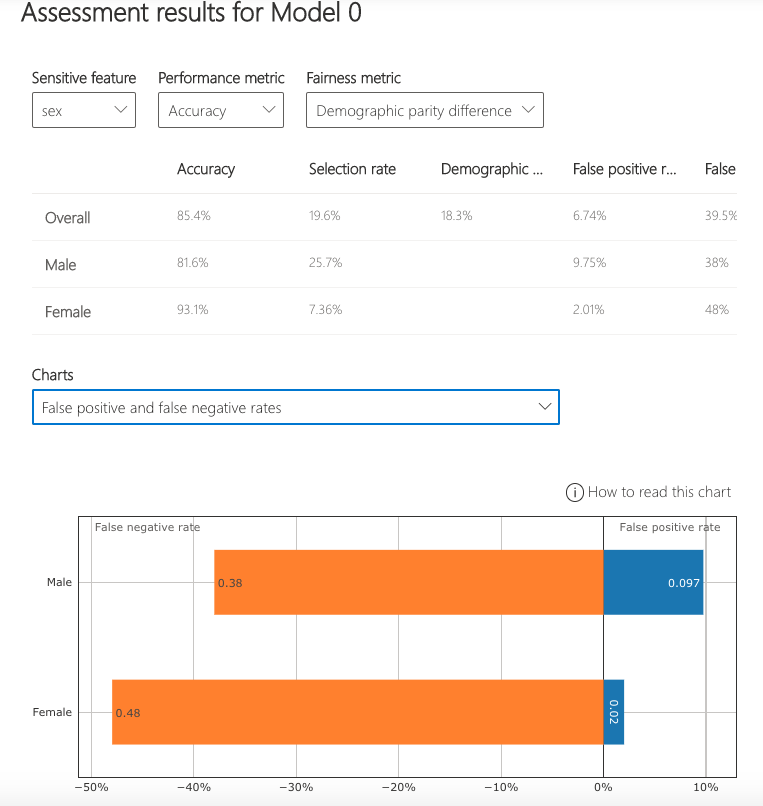
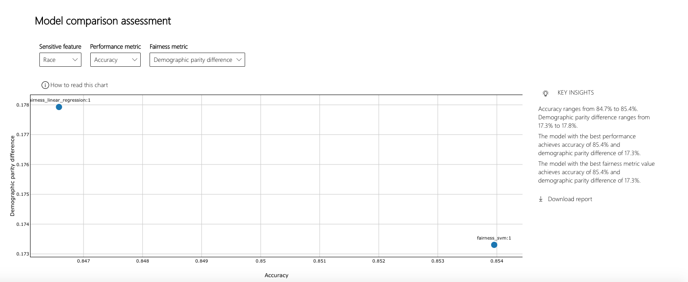

           

# Model Fairness Assessment

Responsible-AI-Widgets provides a collection of model and data exploration and assessment user interfaces that enable a better understanding of AI systems. One of these interfaces is Fairness dashboard, which is a user interface for [Fairlearn](https://github.com/fairlearn/fairlearn).

The Fairness dashboard enables you to use common fairness metrics to assess which groups of people may be negatively impacted by your machine learning model's prediction (females vs. males vs. non-binary gender). You can then use Fairlearn's state-of-the-art unfairness mitigation algorithms to mitigate fairness issues in your classification and regression models.

You can use Fairness dashboard to assess the following harms:

1. Harm of allocation (i.e., to understand whether your loan allocation model approves more applications of a specific advantaged group).
2. Harm of quality of service (i.e., Understand how your model performs on applications of your qualified males group vs. qualified females/non-binary gender.)

You can further navigate trade offs between fairness and performance of your loan allocation model. Once you observe the fairness issues, you can use [Fairlearn](https://github.com/fairlearn/fairlearn)'s mitigation algorithms to mitigate the observed fairness issues.

## Example Notebooks

- [Fairness assessment of a loan allocation model](https://github.com/microsoft/responsible-ai-widgets/blob/master/notebooks/fairness-dashboard-loan-allocation.ipynb)
- [Joint Example: Interpretability and fairness assessment a loan allocation model](https://github.com/microsoft/responsible-ai-widgets/blob/master/notebooks/fairness-interpretability-dashboard-loan-allocation.ipynb)

<a name="fairness dashboard"></a>

## Fairness Dashboard

Please refer to [Fairlearn](https://github.com/fairlearn/fairlearn)'s README and [user guide](https://fairlearn.github.io/v0.5.0/user_guide/index.html) to learn how you can assess and mitigate model's fairness issues. Once your model is trained, load the Fairness dashboard in your notebook to understand how your model’s predictions impact different groups (e.g., different ethnicities). Compare multiple models along different fairness and performance metrics.

### Setup and single-model assessment

To assess a single model’s fairness and performance, the dashboard widget can be launched within a Jupyter notebook as follows:

```python
from raiwidgets import FairnessDashboard

# A_test contains your sensitive features (e.g., age, binary gender)
# y_true contains ground truth labels
# y_pred contains prediction labels

FairnessDashboard(sensitive_features=A_test,
                  y_true=Y_test.tolist(),
                  y_pred=[y_pred.tolist()])
```

Once you load the visualization dashboard, the widget walks the user through the assessment setup, where the user is asked to select


1. The sensitive feature of interest (e.g., `binary gender` or `age`).
   

2. The performance metric (e.g., model precision) along which to evaluate the overall model performance.
   

3. The fairness metric (e.g., demographic parity ratio) along which to evaluate any disparities across groups.
   

These selections are then used to obtain the visualization of the model’s impact on the subgroups. (e.g., one is interested to consider non-binary gender for fairness testing and selects "demographic parity ratio" as a metric of interest to see how females and males are selected to get a loan).





### Comparing multiple models

The dashboard also enables comparison of multiple models, such as the models produced by different learning algorithms and different mitigation approaches, including Fairlearn's [GridSearch](https://fairlearn.github.io/v0.5.0/api_reference/fairlearn.reductions.html#fairlearn.reductions.GridSearch), [ExponentiatedGradient](https://fairlearn.github.io/v0.5.0/api_reference/fairlearn.reductions.html#fairlearn.reductions.ExponentiatedGradient), and [ThresholdOptimizer](https://fairlearn.github.io/v0.5.0/api_reference/fairlearn.postprocessing.html#fairlearn.postprocessing.ThresholdOptimizer).

As before, select the sensitive feature and the performance metric. The model comparison view then depicts the performance and disparity of all the provided models in a scatter plot. This allows the you to examine trade-offs between performance and fairness. Each of the dots can be clicked to open the assessment of the corresponding model. The figure below shows the model comparison view with `binary gender` selected as a sensitive feature and accuracy rate selected as the performance metric.



<a name="supported models"></a>

## Supported Models

This fairness API supports classification and regression models that are trained on datasets in Python `numpy.ndarray`, `pandas.DataFrame`, `iml.datatypes.DenseData`, or `scipy.sparse.csr_matrix` format.

<a name="getting started"></a>

## Getting Started

This repository uses Anaconda to simplify package and environment management.

To setup on your local machine:

<details><summary><strong><em>Install Python module, packages and necessary distributions</em></strong></summary>

```
pip install raiwidgets
```

If you intend to run repository tests:

```
pip install -r requirements.txt
```

</details>

<details>
<summary><strong><em>Set up and run Jupyter Notebook server </em></strong></summary>

Install and run Jupyter Notebook

```
if needed:
          pip install jupyter
then:
jupyter notebook
```

</details>
