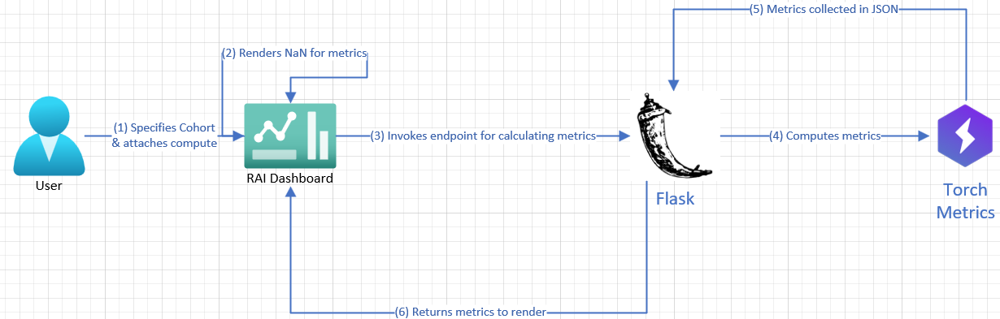

           

# Model Overview for Object Detection

## Implementation Architecture

## Description

### User

When the user generates the dashboard and attaches compute, the RAI Dashboard automatically starts calculating the metrics for the specified test dataset. Calculation of metrics is also triggered as soon as the user adds a new Cohort.

### RAI Dashboard

The dashboard displays NaN with a magenta background while calculating the metrics, and re-renders the Model Overview metrics table with the metric values.

### Flask endpoint

A dedicated Flask endpoint `requestObjectDetectionMetrics` is triggered by the dashboard’s frontend to calculate metrics. The structure, I/O contract of the endpoint is made entirely by piggybacking on RAI toolbox repo’s existing infrastructure for creating custom endpoints.

### TorchMetrics

This python module contains the implementation for the surfaced metrics (Mean Average Precision, Average Precision, and Average Recall) - 

### Endpoint:

Typescript: requestObjectDetectionMetrics
Python: compute_object_detection_metrics

|                   Input                   |                                           Type                                            |
| :---------------------------------------: | :---------------------------------------------------------------------------------------: |
|             Selection indexes             | 2D list with each list   specifying indices of the images   included in that cohort |
| Aggregate Method (egs - ‘Macro’, ‘Micro’) |                                          Value 5                                          |
|                Class name                 |                                            str                                            |
|               IoU threshold               |                                           float                                           |

|                    Output                     |                                          Type                                          |
| :-------------------------------------------: | :------------------------------------------------------------------------------------: |
| Metrics as displayed in the   below table. | 2D List (where each   list has cohort-based metrics   [MAP, class-AP, class-AR]) |

The metrics function on the python side is defined in `responsibleai_dashboard_input.py` and invoked in `responsibleai_dashboard.py`.
