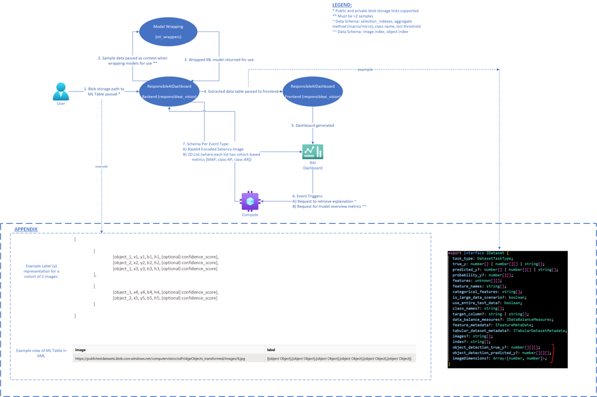

           

# Data Flow Diagram for Object Detection Scenario

## Data Flow Diagram



## Description

When using the DPV2 run of the object detection ResponsibleAIVisionInsights dashboard, the above diagram explains the flow of data through software systems.

1. To start, a user uploads images with corresponding labels to a blob storage. If the blob storage is private, the user should be sure to add the needed authentication to the path.  
   The label should follow the corresponding schema:

```plaintext
[
  [
    [object_1, x1, y1, b1, h1, (optional) confidence_score],
    [object_2, x2, y2, b2, h2, (optional) confidence_score],
    [object_1, x3, y3, b3, h3, (optional) confidence_score]
  ],
  [
    [object_1, x4, y4, b4, h4, (optional) confidence_score],
    [object_2, x5, y5, b5, h5, (optional) confidence_score]
  ]
]
```

2. The model is wrapped. Sample data is used as part of this wrapping process. If there are not at least 2 data points, the wrapping step will fail.

3. Wrapped ML model returned for use

4. The extracted data table is passed to the front end. The following three attributes are unique to the object detection scenario: `object_detection_true_y, 'object_detection_predicted_y`, and `imageDimensions`. See this  for an example.

5. The dashboard is generated

6. There are two types of event-based actions that can trigger backend interaction. First, there is a request to retrieve an explanation (click image -> click object index in drop down). There will be such request whether or not the explanations were precomputed. Second, there is a request for the model overview metrics.

7. The compute is connected.

8. For the first type of event (explanation retrieval), a Base64 encoded saliency image is returned to the RAI dashboard. For the second type of event (model overview metrics), a 2D list is returned containing the mean average precision (MAP) or class average precision (class-AP) or class average recall (class-AR).
