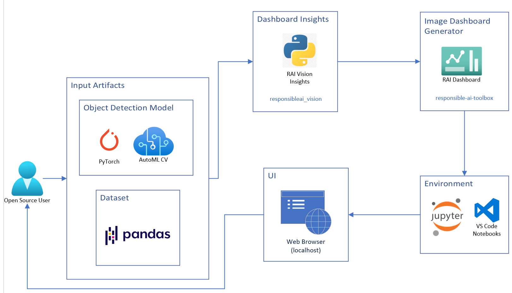
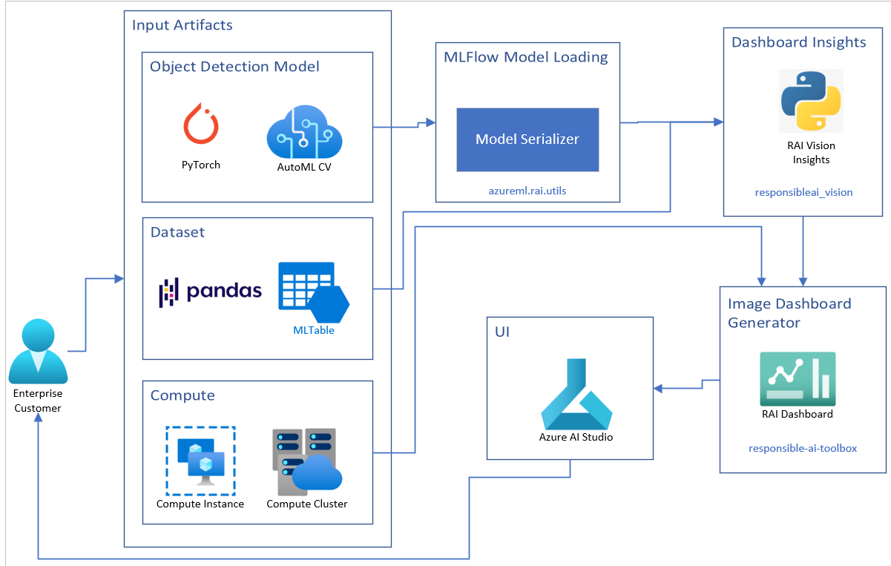
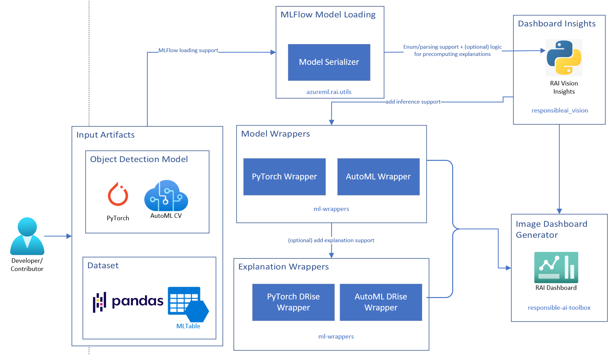

           

# Object Detection Userflows

## Open Source Users

## Enterprise Users

## Developers/Contributors

## Description

### Input Artifacts

The user provides inputs including a model (from pytorch or an E2E differentiable AutoML model), dataset (with pandas or AML’s MLTable format for non-OS users), and a compute for enterprise users.

### MLFlow Model Loading

For enterprise customers running a DPv2 job to generate the dashboard, the models must be serialized using AML’s Model Serializer which utilizes MLflow under the hood to ensure a uniform interface to load the model.

### Dashboard Insights

The user inputs are passed to the `RAIVisionInsights` method in python, which sets up all the insights to be passed to the dashboard.

### Wrappers

The RAI Vision Insights method utilizes wrappers from the `ml-wrappers` GitHub repo to wrap the supplied model for actions such as inference and for generating explanations. Additional wrappers may needed to support new kinds of models or explanation methods.

### Image Dashboard Generator

The `ResponsibleAIDashboard` method takes the Vision Insights object and generates the dashboard. This method is directly invoked by open-source users to get a localhost link of the dashboard, and abstracted away by a DPv2 job for enterprise users.

### Environment

Open-source can use typical python notebooks (such as Jupyter, VS Code etc) to invoke the python methods for generating the dashboard locally.

### UI

This specifies the interface where the dashboard is deployed for viewing and interactions by the user. Open-source users can view this on a typical web browser from the localhost link.

Enterprise users can view the dashboard on Azure AI Studio and get added benefits of using larger CPU/GPU compute, and having access to all dashboards generated for their registered model and user inputs (including the specific dataset version).
